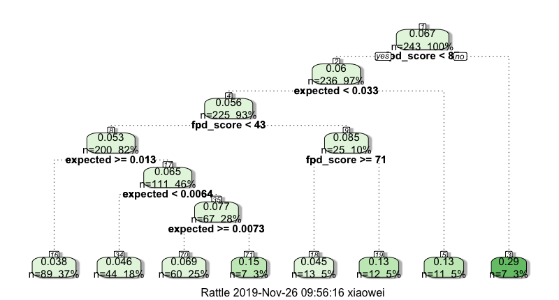
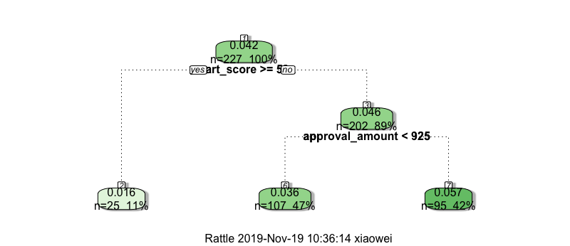
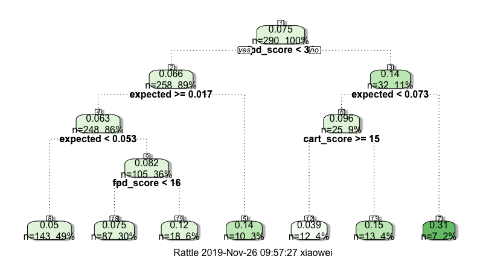

# Fraud Scores

### Introduction

##### Motivation

From time to time, this company experiences spikes in 2mp60 rates that are not able to be predicted by the main underwriting model. Typically, these spikes are concentrated in specific physical locations. The two main causes of these spikes in 2mp60 rates are...

1. Dealer fraud - one or more employees in an affected location are committing fraudulent transactions
2. Fraud ring - coordinated group of people continuously go to locations nearby to where they operate and use stolen PII to obtain loans

A rash of defaults can quickly balloon from tens of thousands of dollars in one weekend to hundreds of thousands month over month. It is imperative that stores affected by fraud are quickly identified and if need be, temporarily or permanently restricted from doing business.

##### Metric Solution

Company reporting uses first payment 30 days past due as the metric for calculating the ratio of fed. The problem is that by the time the fraudulent lease matures to 30 days past due, a full 60 days have passed and much of the fraud already committed. Instead of using 60 days past due, 7 days past due is used.

In addition to number of 1st payment 7 days past due, the default metric also considers the average model predicted default rates and the total number of matured loans to produce a statistically rigorous metric that quantifies the likelihood/unlikelihood of the presence of *X* number of defaults that took place around six weeks ago.

A second metric is produced to quantify each locations' mean cart utilization likelihood. Fraudulent loans tend to have much higher cart utilization rates (near 100%) than good loans. The metric considers the mean cart utilization rate along with total number of loans within the last two weeks vs the mean cart utilization rate of peer locations to create a likelihood metric.

These two metrics will serve as a guidewire for the risk operations staff so that they can easily and quickly identify problematic stores while also lowering their overall workload.

### Data

Data for the first default metric is pulled using the latest two months of leases (from the date of data pull) that have matured to 7 days past due date. Data for the second cart utilization rate metric is pulled using the latest two weeks of loans and is calculated as outgoing_payment_amount / (approval_amount + bonus_amount).

For example, if the metrics were produced on Jan 1st 2019, the data pulled for default metric would be loans that originated after Nov 1st 2019 and have matured to 7 days past due date by Jan 1st 2019. Similarly, the data for cart utilization only uses the past two weeks and would be loans that originated post Dec 16th 2018.

Separately, two sets of historical evaluation data were pulled for each metric to use as back testing. The evaluation metrics are produced from two historical data pulls and combined together. Finally, a period of data immediately post the historical pulls are used to evaluate the effectiveness of the metrics.

The date ranges for the first default metric were Aug-Sep 2018 and Nov to Dec 2018 with corresponding default stats from Oct 2018 and Jan 2019 as the predicted variable.

Similarly, two sets of two weeks worths of data were pulled from the second half of Sept and Dec 2018 with corresponding defaults stats from Oct 2018 and Jan 2019 as the predicted variable.

### Statistic Methodology

##### Custom Default Metric using Beta distribution

The Beta distribution is used to model the distribution of the mean first payment 7 days past due for each retail location. The beta distribution is the conjugate prior for the binomial distribution and is capable of capturing the distribution of expected default rates (the "prior" in Bayesian statistics) and the the estimation of the "posterior" when prior is combined with actuals.

The mean of the prior for each location is the debiased mean of the predicted first payment default rate. Debias factors for each merchant channel is created by dividing the number of defaults 7 days past due by the total number of matured leases. Only locations with <20% default rate and at least 5 leases are considered when creating debias factors.

The alpha and beta parameters for each locations' priors are created using the debiased mean calculated in the previous step and the variance of mean location default rates in each merchant channel.

The custom default metric is created by finding the critical value at 95% of the prior distribution and finding the "1 - CDF" of the posterior distribution at that critical value for each location.

##### Custom Cart Utilization Metric using Two Sample T-test of Means

For each merchant channel, locations with at least 5 leases and <20% default rate are used to create the first T-distribution against of which every other location within the merchant channel is tested against. 
The custom metric is a two sided p-value generated from two sample T-test of means with unequal variances (even though we techinically are doing a one-sided test this shouldn't matter for the purposes of this metric).

### Evaluation Summary

Evaluation of custom metrics was done by using default rates as the dependent variable following the period of time in which the data was used to create the custom metrics as independent variables. The findings concluded that the custom default metric is highly significant (p<0.01) in predicting subsequent location based default rates while the custom cart utilization metric is only weakly predictive when used in conjunction with the default metric and not at all predictive when used by itself.

Below is a decision tree modeling the first (2mp7) custom metric and mean location v4 model risk as predictors and 2mp60 as the evaluation metric:


Corresponding regression model summary

```

Coefficients:
             Estimate Std. Error t value Pr(>|t|)    
(Intercept) 0.0073263  0.0116910   0.627  0.53141    
expected    0.7734896  0.2672891   2.894  0.00412 ** 
fpd_score   0.0018859  0.0002666   7.074 1.29e-11 ***
---
Signif. codes:  0 ‘***’ 0.001 ‘**’ 0.01 ‘*’ 0.05 ‘.’ 0.1 ‘ ’ 1

Residual standard error: 0.08547 on 270 degrees of freedom
Multiple R-squared:  0.1834,	Adjusted R-squared:  0.1773 
F-statistic: 30.32 on 2 and 270 DF,  p-value: 1.322e-12
```

Below is a decision tree modeling the second (cart utilization) custom metric and approval amount as predictors and 2mp60 as the evaluation metric:


Corresponding regression model summary

```
Coefficients:
                  Estimate Std. Error t value Pr(>|t|)    
(Intercept)      1.149e-01  1.880e-02   6.114 3.07e-09 ***
cart_score      -3.767e-04  2.934e-04  -1.284    0.200    
approval_amount -3.101e-05  2.074e-05  -1.495    0.136    
---
Signif. codes:  0 ‘***’ 0.001 ‘**’ 0.01 ‘*’ 0.05 ‘.’ 0.1 ‘ ’ 1

Residual standard error: 0.1019 on 295 degrees of freedom
Multiple R-squared:  0.01924,	Adjusted R-squared:  0.01259 
F-statistic: 2.893 on 2 and 295 DF,  p-value: 0.05696
```

Combining both fpd and cart custom scores


```
Coefficients:
              Estimate Std. Error t value Pr(>|t|)    
(Intercept)  0.0487536  0.0139598   3.492 0.000554 ***
expected     0.3729297  0.2111496   1.766 0.078431 .  
fpd_score    0.0013903  0.0002837   4.900 1.61e-06 ***
cart_score  -0.0005338  0.0002485  -2.148 0.032520 *  
---
Signif. codes:  0 ‘***’ 0.001 ‘**’ 0.01 ‘*’ 0.05 ‘.’ 0.1 ‘ ’ 1

Residual standard error: 0.08252 on 286 degrees of freedom
Multiple R-squared:  0.1123,	Adjusted R-squared:  0.103 
F-statistic: 12.07 on 3 and 286 DF,  p-value: 1.851e-07
```

### Code

cart_analysis.py - data cleaning/transformations to create the second custom metric

cart_query.sql - SQL to pull data from MySQL to create the second custom metric

cart_se.py - exploratory data analysis code for cart standard error

constants.py - file containing constant values that are used in metric generation

fpd_analysis.py - data cleaning/transformations to create the first custom metric

fpd_query.sql - SQL to pull data from MySQL to create the first custom metric

get_mysql.py - reads in SQL code and pulls and stores data into csv files

stats.py - statistical code to create both metrics

test_* - unittest code

All code in "evaluation code" folder is code used to evaluate the effectiveness of the custom metrics


##### Additional implementation steps:

In addition to replacing the two Z-Score columns and renaming them to "FPD Score" and "Cart Score" the dashboard should be changed to not display any transaction in locations where both of the new custom scores are < 7 (still use old behavior when either score is missing). This should cut down the number of manual review transactions by more than half.

##### Future implementation possibility

If the script is run once a day, the custom scores can be produced and refreshed each day and incorporated as part of the handsets call in mongo. This would allow the custom scores to be used as a part of the decisioning engine and part of the main decisioning model. Another possibility would be that stores experiencing abnormally high scores would automatically have their approval amounts reduced as part of the decisioning cutoff table.